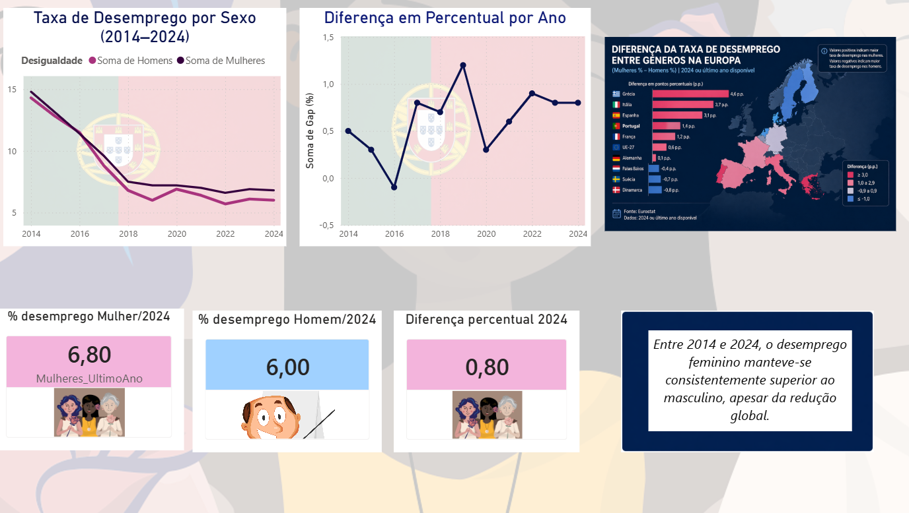

## 📊 Insight Principal

O desemprego feminino manteve-se consistentemente superior ao masculino entre 2014 e 2024, evidenciando
uma desigualdade persistente no mercado de trabalho.

# 📊 Análise do Desemprego por Género em Portugal

  

  

## 📌 Introdução

O desemprego é um dos principais indicadores económicos e sociais de um país. Em Portugal, a análise da taxa de 
desemprego por género permite compreender desigualdades estruturais no mercado de trabalho, nomeadamente entre 
homens e mulheres.
Este projeto tem como objetivo analisar a evolução do desemprego por género ao longo do tempo, identificando 
diferenças e tendências relevantes.

---

## 🎯 Objetivo

O principal objetivo deste projeto é:

- Comparar a taxa de desemprego entre homens e mulheres em Portugal  
- Analisar a evolução entre 2014 e 2024  
- Identificar a diferença percentual (gap) entre géneros  
- Visualizar os dados através de um dashboard interativo em Power BI  

---

## 🛠️ Tecnologias utilizadas

- Python (Pandas)
- Power BI
- GitHub

## ⚙️ Desenvolvimento

O projeto foi desenvolvido em três fases principais:

### 1. Recolha de Dados  
Os dados foram obtidos da fonte :PorData, garantindo fiabilidade 
e relevância estatística.

### 2. Tratamento de Dados  
Foi utilizada a linguagem Python, com a biblioteca pandas, para:
- Limpeza dos dados  
- Tratamento de valores nulos  
- Conversão de formatos  
- Criação de métricas como o gap percentual  

### 3. Visualização  
Os dados tratados foram importados para o : Ficheiro csv, onde foi desenvolvido um dashboard com:
- Gráficos de evolução temporal  
- Indicadores chave (KPIs)  
- Comparação entre géneros  

---

## 📊 Conclusão

A análise evidencia que, apesar da redução global do desemprego ao longo dos anos, a taxa de desemprego feminina 
manteve-se consistentemente superior à masculina. 
Este resultado sugere a existência de desigualdades persistentes no mercado de trabalho, reforçando a importância 
de políticas públicas direcionadas para a igualdade de género.
O projeto demonstra também a importância da análise de dados como ferramenta para compreender fenómenos sociais e 
apoiar a tomada de decisão.
